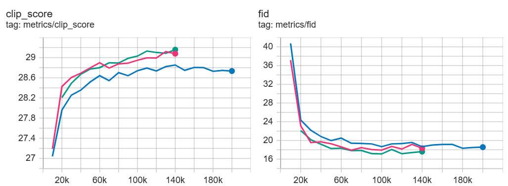

<div align="center">
  <picture>
    <source media="(prefers-color-scheme: dark)" srcset="assets/kvae-white.png">
    <source media="(prefers-color-scheme: light)" srcset="assets/kvae-black.png">
    
  </picture>
</div>
<div align="center">
  <a href="https://habr.com/ru/companies/sberbank/articles/966450/">Habr</a> | <a href="https://kandinskylab.ai/">Project Page</a> | Technical Report (soon) | 🤗 <a href=https://huggingface.co/kandinskylab/KVAE-3D-1.0> KVAE-3D </a> / <a href=https://huggingface.co/kandinskylab/KVAE-2D-1.0> KVAE-2D </a> 
</div>

<h1>KVAE 1.0: Video and Image tokenizers</h1>

In this repository, we provide tokenizers for image and video diffusion models: 
KVAE-2D and KVAE-3D.

KVAE-2D model has compression 8x8 and 16 latent channels.

KVAE-3D model has time compression 4, spacial compression 8x8 and 16 latent channels 

## Evaluation results

### KVAE-2D
Reconstructions comparison of KVAE-2D and Flux:


Evaluation results of KVAE-2D model on [Imagenet-256](https://huggingface.co/datasets/benjamin-paine/imagenet-1k-256x256) (valid) and [DIV2K](https://data.vision.ee.ethz.ch/cvl/DIV2K/) (valid, high-resolution). 
All compared models perform 8x8 compression with 16 latent channels:

| Dataset             | Model   | PSNR      | SSIM     | LPIPS     | rFID     |                                                                
|---------------------|---------|-----------|----------|-----------|----------|
| ImageNet (256, val) | Wan-2.1 | 29.03     | 0.85     | 0.069     | 0.62     |                                                                |
| ImageNet (256, val) | Flux    | 31.11     | **0.91** | **0.041** | **0.11** |
| ImageNet (256, val) | KVAE 2D | **31.71** | **0.91** | 0.054     | 0.46     |
| DIV2K               | Wan-2.1 | 31.87     | 0.89     | 0.069     | -        |                                                                |
| DIV2K               | Flux    | 32.64     | 0.91     | 0.061     | -        |
| DIV2K               | KVAE 2D | **33.67** | **0.92** | **0.060** | -        |

DiT training metrics comparison (blue — DiT+Flux, green and red — two versions of DiT+KVAE-2D):



### KVAE-3D

Reconstructions comparison of KVAE-3D and Hunyuan:


Evaluation results of KVAE-3D model on [MCL-JCV](https://mcl.usc.edu/mcl-jcv-dataset/) dataset. All compared models perform 4x8x8 compression with 16 latent channels:

| Model        | PSNR      | SSIM     | LPIPS     |
|--------------|-----------|----------|-----------|
| Wan-2.1      | 33.75     | 0.90     | 0.089     |
| HunyuanVideo | 33.91     | 0.91     | 0.103     | 
| KVAE-3D      | **35.63** | **0.92** | **0.088** |


## Inference examples

### Setup

Install requirements:
```sh 
pip install -r requirements.txt
```

### KVAE-2D inference
```python
from kvae_2d.model import KVAE2D

model = KVAE2D.from_pretrained("kandinskylab/KVAE-2D-1.0").eval()
latent = model.encode(image)['y_hat']
rec = model.decode(latent)
```
More detailed example is presented in `inference_2d.ipynb`

### KVAE-3D inference
For simple test, go to `kvae_3d` folder and run
```sh
python inference.py --frames 999
```

To use optimized compiled encoder version, run (max duration 257 frames):
```sh
python inference.py --frames 257 --optim
```

## Citation

```
@misc{kvae_v1_2025,
    author = {Kirill Chernyshev, Andrey Shutkin, Ilia Vasiliev,
              Denis Parkhomenko, Ivan Kirillov,
              Dmitrii Mikhailov, Denis Dimitrov},
    title = {KVAE 1.0: 2D and 3D tokenizers for Image & Video generation models},
    howpublished = {\url{https://github.com/kandinskylab/kvae-1}},
    year = 2025
}
