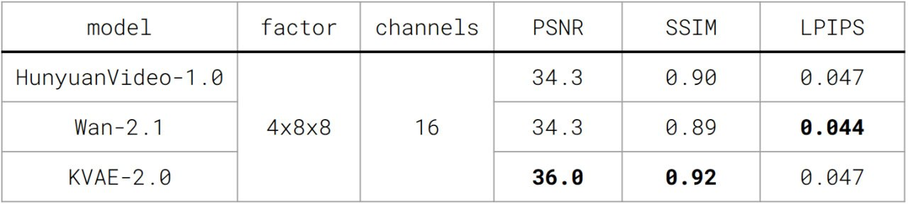
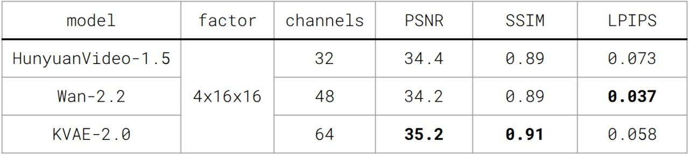
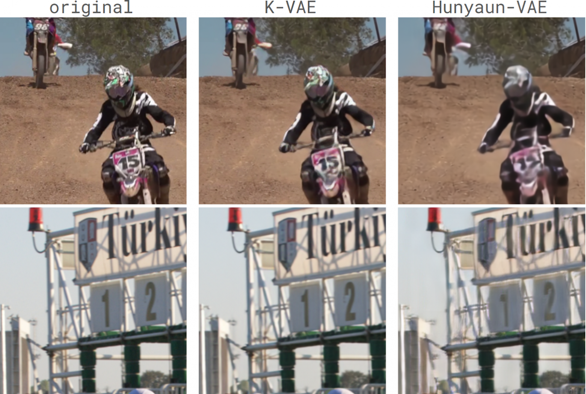
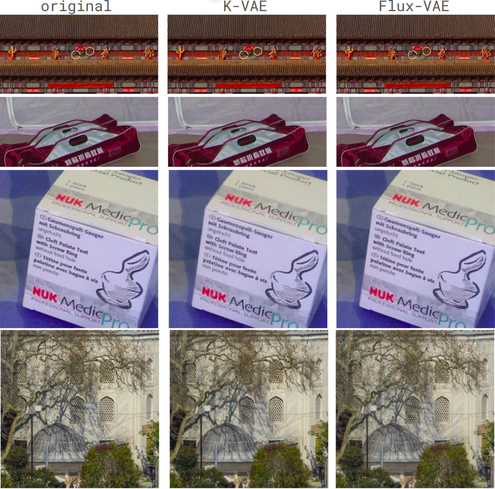

<div align="center">
  <a href="https://habr.com/ru/companies/sberbank/articles/966450/">Habr-KVAE-1.0</a> | <a href="https://kandinskylab.ai/">Project Page</a> | Technical Report (soon)
  
  🤗 <a href=https://huggingface.co/kandinskylab/KVAE-2D-1.0> KVAE-2D-1.0 </a> / <a href=https://huggingface.co/kandinskylab/KVAE-3D-1.0> KVAE-3D-1.0 </a>  / <a href=https://huggingface.co/kandinskylab/KVAE-3D-2.0-t4s8> KVAE-3D-2.0-t4s8 </a>  / <a href=https://huggingface.co/kandinskylab/KVAE-3D-2.0-t4s16> KVAE-3D-2.0-t4s16 </a> 
</div>

<h1>KVAE: Video and Image tokenizers</h1>

In this repository, we provide tokenizers for image and video diffusion models: 
KVAE-2D and KVAE-3D.

## Inference instruction

### Setup

Create environment with torch==2.8.0 с CUDA 12.8
```sh
conda create -n kvae_inference python=3.11
conda activate kvae_inference
pip install -r requirements.txt
```

### KVAE inference 

To run a 2d models on some dataset to calculate metrics, you can use the script:
```sh
PYTHONPATH=. python scripts/inference_2d_kvae.py --dataset_folder ./assets/images/ --model KVAE_1.0 
```

To run a 3d models:
```sh
PYTHONPATH=. python scripts/inference_3d_kvae.py --dataset_folder ./assets/test1/ --model KVAE_2.0-t4s8
```

If you want to save the reconstructions, then set the parameter  `--saving_folder` with the folder to save `./your_path/`. Please note that this will affect the running time, especially of the 3d model, even though saving works asynchronously with the rest of the components.

More detailed example of work with models is presented in [`inference_examples.ipynb`](scripts/inference_examples.ipynb)

To use the library `mediapy`, you will need to install `ffmpeg`:
```sh
conda install -c conda-forge ffmpeg
pip install -q mediapy
```

## Evaluation results

### KVAE-3D-2.0-t4s8

Evaluation results of KVAE-3D-2.0, Hunyuan and Wan on [MCL-JCV (720p)](https://mcl.usc.edu/mcl-jcv-dataset/) dataset. All compared models perform 4x8x8 compression with 16 latent channels:




### KVAE-3D-2.0-t4s16

Evaluation results of KVAE-3D-2.0, Hunyuan and Wan on [MCL-JCV (720p)](https://mcl.usc.edu/mcl-jcv-dataset/) dataset. All compared models perform 4x16x16 compression:




### KVAE-3D-1.0

Reconstructions comparison of KVAE-3D and Hunyuan:



Evaluation results of KVAE-3D model on [MCL-JCV](https://mcl.usc.edu/mcl-jcv-dataset/) dataset with downsampling to 540p. All compared models perform 4x8x8 compression with 16 latent channels:

| Model        | PSNR      | SSIM     | LPIPS     |
|--------------|-----------|----------|-----------|
| Wan-2.1      | 33.75     | 0.90     | 0.089     |
| HunyuanVideo | 33.91     | 0.91     | 0.103     | 
| KVAE-3D      | **35.63** | **0.92** | **0.088** |

Due to problems with high resolutions, here inference was performed at a lower resolution 540p than for the new models 2.0, which were inferred at a resolution of 720p


### KVAE-2D-1.0
Reconstructions comparison of KVAE-2D and Flux:



Evaluation results of KVAE-2D model on [Imagenet-256](https://huggingface.co/datasets/benjamin-paine/imagenet-1k-256x256) (valid) and [DIV2K](https://data.vision.ee.ethz.ch/cvl/DIV2K/) (valid, high-resolution). 
All compared models perform 8x8 compression with 16 latent channels:

| Dataset             | Model   | PSNR      | SSIM     | LPIPS     | rFID     |                                                                
|---------------------|---------|-----------|----------|-----------|----------|
| ImageNet (256, val) | Wan-2.1 | 29.03     | 0.85     | 0.069     | 0.62     |                                                                |
| ImageNet (256, val) | Flux    | 31.11     | **0.91** | **0.041** | **0.11** |
| ImageNet (256, val) | KVAE 2D | **31.71** | **0.91** | 0.054     | 0.46     |
| DIV2K               | Wan-2.1 | 31.87     | 0.89     | 0.069     | -        |                                                                |
| DIV2K               | Flux    | 32.64     | 0.91     | 0.061     | -        |
| DIV2K               | KVAE 2D | **33.67** | **0.92** | **0.060** | -        |

