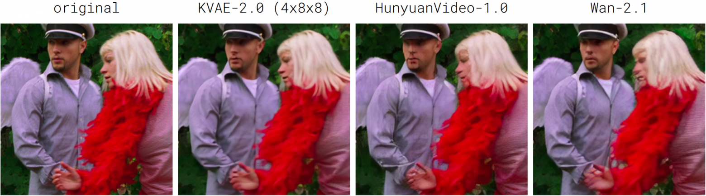
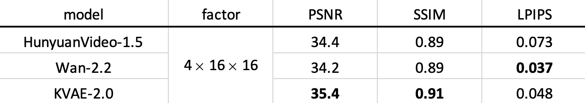
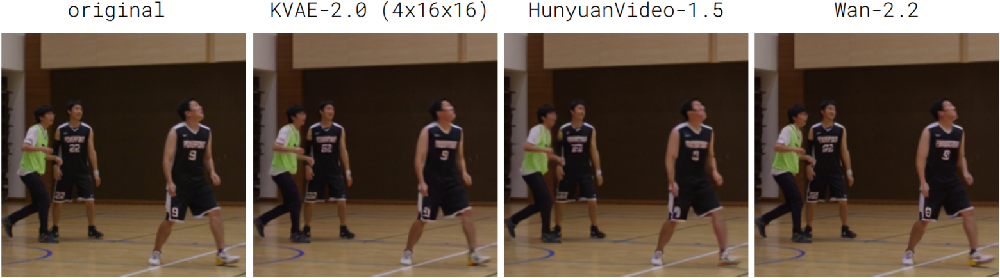
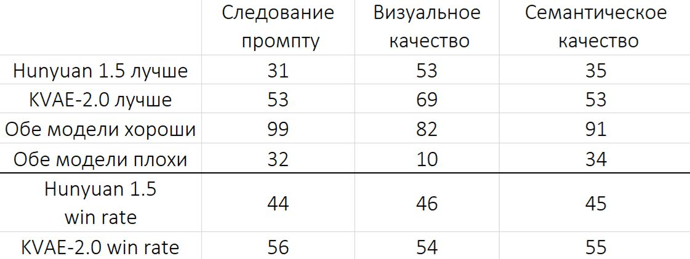
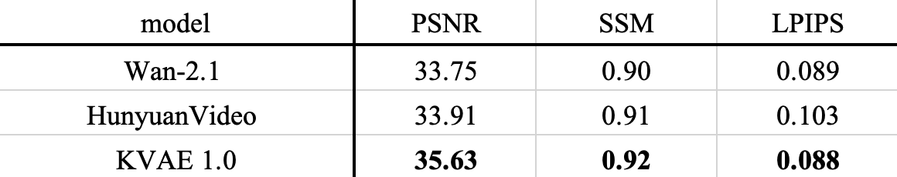
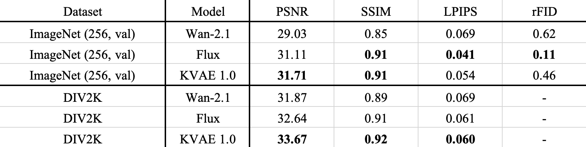

<div align="center">
  <a href="https://habr.com/ru/companies/sberbank/articles/966450/">Habr-KVAE-1.0</a> | <a href="https://habr.com/ru/companies/sberbank/articles/1016814/">Habr-KVAE-2.0</a> | <a href="https://kandinskylab.ai/">Project Page</a> | Technical Report (soon)
  
  🤗 <a href=https://huggingface.co/kandinskylab/KVAE-2D-1.0> KVAE-2D-1.0 </a> / <a href=https://huggingface.co/kandinskylab/KVAE-3D-1.0> KVAE-3D-1.0 </a>  / <a href=https://huggingface.co/kandinskylab/KVAE-3D-2.0-t4s8> KVAE-3D-2.0-t4s8 </a>  / <a href=https://huggingface.co/kandinskylab/KVAE-3D-2.0-t4s16> KVAE-3D-2.0-t4s16 </a> 
</div>

<h1>KVAE: Video and Image tokenizers</h1>

In this repository, we provide tokenizers for image and video diffusion models: 
KVAE 1.0 and KVAE 2.0.

## Inference instruction

### Setup

Create environment with torch==2.8.0 с CUDA 12.8
```sh
conda create -n kvae_inference python=3.11
conda activate kvae_inference
pip install -r requirements.txt
```

### KVAE inference 

To run an image model on some dataset to calculate metrics, you can use the script:
```sh
PYTHONPATH=. python scripts/inference_2d_kvae.py --dataset_folder ./assets/images/ --model KVAE_1.0 
```

To run video models:
```sh
PYTHONPATH=. python scripts/inference_3d_kvae.py --dataset_folder ./assets/test1/ --model KVAE_2.0-t4s8
```

If you want to save the reconstructions, then set the parameter  `--saving_folder` with the folder to save `./your_path/`. Please note that this will affect the running time, especially of the video model, even though saving works asynchronously with the rest of the components.

More detailed example of work with models is presented in [`inference_examples.ipynb`](scripts/inference_examples.ipynb)

To use the library `mediapy`, you will need to install `ffmpeg`:
```sh
conda install -c conda-forge ffmpeg
pip install -q mediapy
```

## Evaluation results

### KVAE-3D-2.0-t4s8

Model KVAE-3D-2.0-t4s8 has time compression 4 and spacial compression 8x8.

#### Evaluation of reconstruction

Evaluation results of video KVAE 2.0, Hunyuan 1.0 and Wan 2.1 on [MCL-JCV (720p)](https://mcl.usc.edu/mcl-jcv-dataset/) dataset. All compared models perform 4x8x8 compression with 16 latent channels:


Reconstruction comparison of KVAE 2.0, Hunyuan 1.0 and Wan 2.1




### KVAE-3D-2.0-t4s16

Model KVAE-3D-2.0-t4s16 has time compression 4 and spacial compression 16x16

#### Evaluation of reconstruction

Evaluation results of video KVAE 2.0, Hunyuan 1.5 and Wan 2.2 on [MCL-JCV (720p)](https://mcl.usc.edu/mcl-jcv-dataset/) dataset. For the HunyuanVideo model, due to the presence of the full attention block, tiling (default parameters) was used. All compared models perform 4x16x16 compression:



Reconstruction comparison of KVAE 2.0, Hunyuan 1.5 and Wan 2.2



#### Evaluation of latent space qualities for generation model

The purpose of the tokenizer is to create a latent space for the generative model, so its superiority can only be established by evaluating the quality of the generations. To do this, we directly compared models (side-by-side, SBS) with the participation of several users. Each was shown pairs of images created for the same query. People evaluated each pair according to three characteristics: adherence to promptness, visual and semantic quality. Quite a lot of marked-up pairs allow you to establish a better-worse relationship between a pair of models. The honesty of the comparison is ensured by a fixed training dataset for the generative model, its architecture, as well as the learning strategy (optimizer parameters, number of steps, batch size, and other hyperparameters). Below are the results of two SBS with KVAE-2.0 4x16x16:




### KVAE-3D-1.0

#### Evaluation of reconstruction

Evaluation results of video KVAE 1.0 model on [MCL-JCV](https://mcl.usc.edu/mcl-jcv-dataset/) dataset with downsampling to 540p. All compared models perform 4x8x8 compression with 16 latent channels:



Due to problems with high resolutions, here inference was performed at a lower resolution 540p than for the new models 2.0, which were inferred at a resolution of 720p

Reconstructions comparison of video KVAE 1.0 and Hunyuan 1.0:


### KVAE-2D-1.0

#### Evaluation of reconstruction

Evaluation results of image KVAE model on [Imagenet-256](https://huggingface.co/datasets/benjamin-paine/imagenet-1k-256x256) (valid) and [DIV2K](https://data.vision.ee.ethz.ch/cvl/DIV2K/) (valid, high-resolution). 
All compared models perform 8x8 compression with 16 latent channels:



Reconstructions comparison of image KVAE 1.0 and Flux:


## Citation

```
@misc{kvae_2_2026,
    author = {Andrey Shutkin, Denis Parkhomenko, Kirill Chernyshev,
              Ivan Kirillov, Denis Dimitrov,
              Valeriya Kobenko, Kirill Malakhov},
    title = {KVAE 2.0: video tokenizers for Image & Video generation models},
    howpublished = {\url{https://github.com/kandinskylab/kvae}},
    year = 2026
}
@misc{kvae_1_2025,
    author = {Kirill Chernyshev, Andrey Shutkin, Ilia Vasiliev,
              Denis Parkhomenko, Ivan Kirillov,
              Dmitrii Mikhailov, Denis Dimitrov},
    title = {KVAE 1.0: image and video tokenizers for Image & Video generation models},
    howpublished = {\url{https://github.com/kandinskylab/kvae}},
    year = 2025
}
```