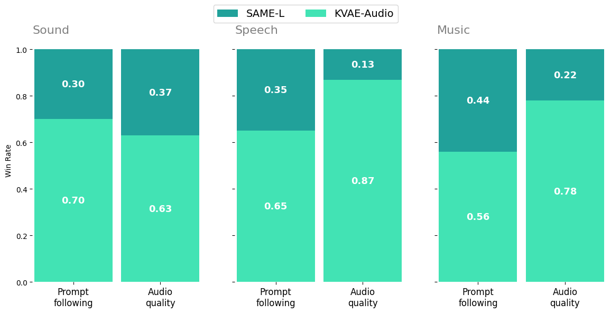
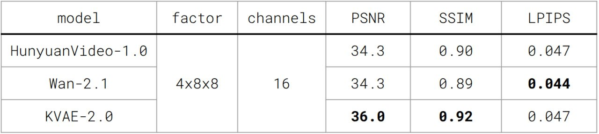
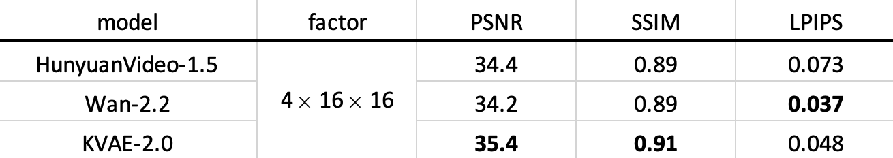
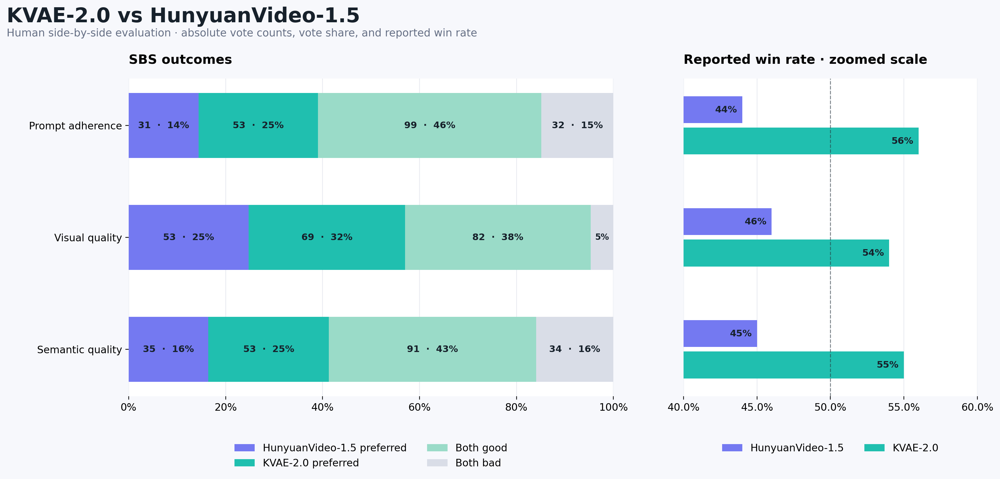
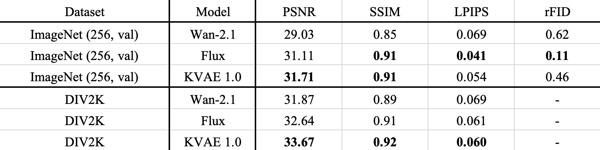
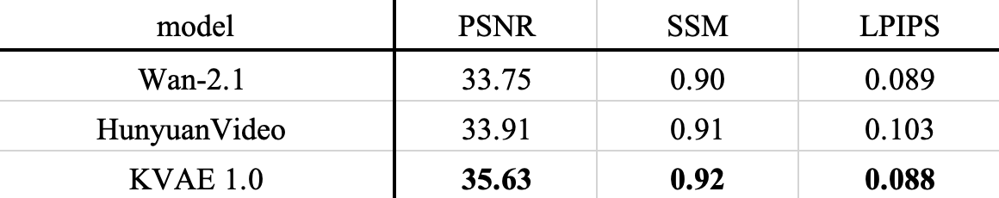

<div align="center">

  <picture>
    <source media="(prefers-color-scheme: dark)" srcset="assets/kvae-white-no-version.png">
    <source media="(prefers-color-scheme: light)" srcset="assets/kvae-black-no-version.png">
    
  </picture>

  <a href="https://habr.com/ru/companies/sberbank/articles/966450/">KVAE 1.0 on Habr</a> | <a href="https://habr.com/ru/companies/sberbank/articles/1016814/">KVAE 2.0 on Habr</a> | <a href="https://habr.com/ru/companies/sberbank/articles/1053410/">KVAE-Audio on Habr</a> | <a href="https://kandinskylab.ai/">Project page</a> | <a href="http://arxiv.org/abs/2608.05798">Technical report</a>

  Hugging Face: <a href="https://huggingface.co/kandinskylab/KVAE-Audio">Audio</a> | <a href="https://huggingface.co/kandinskylab/KVAE-2D-1.0">Image 1.0</a> | <a href="https://huggingface.co/kandinskylab/KVAE-3D-1.0">Video 1.0</a> | <a href="https://huggingface.co/kandinskylab/KVAE-3D-2.0-t4s8">Video 2.0 t4s8</a> | <a href="https://huggingface.co/kandinskylab/KVAE-3D-2.0-t4s16">Video 2.0 t4s16</a>
</div>

# KVAE: audio, image, and video tokenizers

KVAE provides pretrained variational autoencoders for converting audio, images and videos into compact latent representations for diffusion generative models. All model classes use the same high-level workflow: `from_pretrained -> encode -> latent distribution -> decode`.

## Available models

| Modality | Python class | Hugging Face model | Inference |
| --- | --- | --- | --- |
| Audio | `KVAEAudio` | [KVAE-Audio](https://huggingface.co/kandinskylab/KVAE-Audio) | [`inference_1d_kvae.py`](scripts/inference_1d_kvae.py) |
| Image | `KVAEImage` | [KVAE-2D-1.0](https://huggingface.co/kandinskylab/KVAE-2D-1.0) | [`inference_2d_kvae.py`](scripts/inference_2d_kvae.py) |
| Video | `KVAEVideo` | [KVAE-3D-1.0](https://huggingface.co/kandinskylab/KVAE-3D-1.0) | [`inference_3d_kvae.py`](scripts/inference_3d_kvae.py) |
| Video | `KVAEVideo` | [KVAE-3D-2.0-t4s8](https://huggingface.co/kandinskylab/KVAE-3D-2.0-t4s8) | [`inference_3d_kvae.py`](scripts/inference_3d_kvae.py) |
| Video | `KVAEVideo` | [KVAE-3D-2.0-t4s16](https://huggingface.co/kandinskylab/KVAE-3D-2.0-t4s16) | [`inference_3d_kvae.py`](scripts/inference_3d_kvae.py) |

## Highlights

**KVAE-Audio** is a continuous full-band 48 kHz tokenizer with 166.9M parameters and 64 latent channels. Under a fixed text-to-audio generator, it achieves the best CLAP, CE, PQ, and all reported FAD scores on AudioCaps among the compared autoencoders. On MUSDB18-HQ reconstruction, it leads all reported MEL, STFT, waveform, SI-SDR, SDR, and SNR metrics.

**KVAE-Video 2.0** is available with temporal compression 4 and spatial compression 8 x 8 or 16 x 16. The t4s8 model keeps 16 latent channels, while the t4s16 variant provides a more compact representation for higher spatial compression.

<details>
<summary><b>Show selected evaluation figures</b></summary>

### KVAE-Audio latent-space qualities for generation



### KVAE-Video 2.0 reconstruction

#### t4s8



#### t4s16



### KVAE-Video 2.0 latent-space qualities for generation



</details>

<details>
<summary><b>Previous versions: KVAE 1.0</b></summary>

**KVAE-2D-1.0** uses 8 x 8 spatial compression with 16 latent channels and provides the original image tokenizer released with KVAE 1.0.



**KVAE-3D-1.0** uses 4 x 8 x 8 compression with 16 latent channels. It was evaluated at 540p, while the newer KVAE-Video 2.0 models target 720p evaluation and improved high-resolution processing.



</details>

Full metric tables, reconstruction comparisons, human evaluations, and audio generation examples are available in [assets/docs/EVALUATION.md](assets/docs/EVALUATION.md).

## Quick start

Create an environment with Python 3.11 and the PyTorch 2.8.0 CUDA 12.8 build,
then install this repository in editable mode:

```bash
conda create -n kvae_inference python=3.11
conda activate kvae_inference

pip install torch==2.8.0 torchvision==0.23.0 torchaudio==2.8.0 --index-url https://download.pytorch.org/whl/cu128
pip install -r requirements.txt
pip install --editable .
```

## Inference

Run commands from the repository root. The first run downloads weights from Hugging Face Hub unless they are already cached.

### Audio

```bash
python -m scripts.inference_1d_kvae \
    --dataset_folder ./assets/audio_test \
    --saving_folder ./outputs/audio
```

The released audio model expects mono 48 kHz input and runs in `float32`. Loading preserves the original channels and sample rate; it does not silently resample, downmix, crop, or normalize the input. Saved reconstructions are loudness-matched to their input using the same procedure as the original audio implementation.

### Image

```bash
python -m scripts.inference_2d_kvae \
    --dataset_folder ./assets/image_test \
    --model KVAE_1.0 \
    --saving_folder ./outputs/images
```

Image inference uses `bfloat16` and expects PNG inputs normalized to the model range. Use `--img_size H,W` to resize samples to a common shape and enable batching; without an explicit size, the inference script uses batch size one. Reconstructions can be saved as PNG files, and the script reports PSNR and LPIPS.

### Video

```bash
python -m scripts.inference_3d_kvae \
    --dataset_folder ./assets/video_test \
    --model KVAE_2.0-t4s8 \
    --seg_len 16 \
    --saving_folder ./outputs/video
```

Video inference uses `bfloat16` and expects one directory of PNG frames per video. `--seg_len` controls temporal chunking, while `--input_norm` selects the input normalization convention.

Temporal context is cached inside the causal convolution, residual, and sampling blocks. These caches are mutable, so one `KVAEVideo` instance cannot safely process independent samples concurrently or interleave their chunks. Use a separate model instance per concurrent stream. Sequential calls are supported because `encode` and `decode` reset their caches before and after each call.

Detailed Python API examples, input layouts, metrics, and script options are in [assets/docs/INFERENCE.md](assets/docs/INFERENCE.md).

A runnable example for all three modalities is available in [scripts/inference_examples.ipynb](scripts/inference_examples.ipynb).

## Citation

```bibtex
@misc{kvae_audio_2026,
    author = {Ivan Kirillov, Denis Parkhomenko, Alexander Ivanov,
              Azat Saginbaev, Egor Silvestrov, Denis Dimitrov},
    title = {KVAE-Audio: a full-band continuous audio tokenizer for generative models},
    howpublished = {\url{https://github.com/kandinskylab/kvae}},
    year = {2026}
}

@misc{kvae_2_2026,
    author = {Andrey Shutkin, Denis Parkhomenko, Kirill Chernyshev,
              Ivan Kirillov, Denis Dimitrov,
              Valeriya Kobenko, Kirill Malakhov},
    title = {KVAE 2.0: video tokenizers for Image & Video generation models},
    howpublished = {\url{https://github.com/kandinskylab/kvae}},
    year = {2026}
}

@misc{kvae_1_2025,
    author = {Kirill Chernyshev, Andrey Shutkin, Ilia Vasiliev,
              Denis Parkhomenko, Ivan Kirillov,
              Dmitrii Mikhailov, Denis Dimitrov},
    title = {KVAE 1.0: image and video tokenizers for Image & Video generation models},
    howpublished = {\url{https://github.com/kandinskylab/kvae}},
    year = {2025}
}
```

## License

The project is distributed under the terms of [LICENSE](LICENSE).
