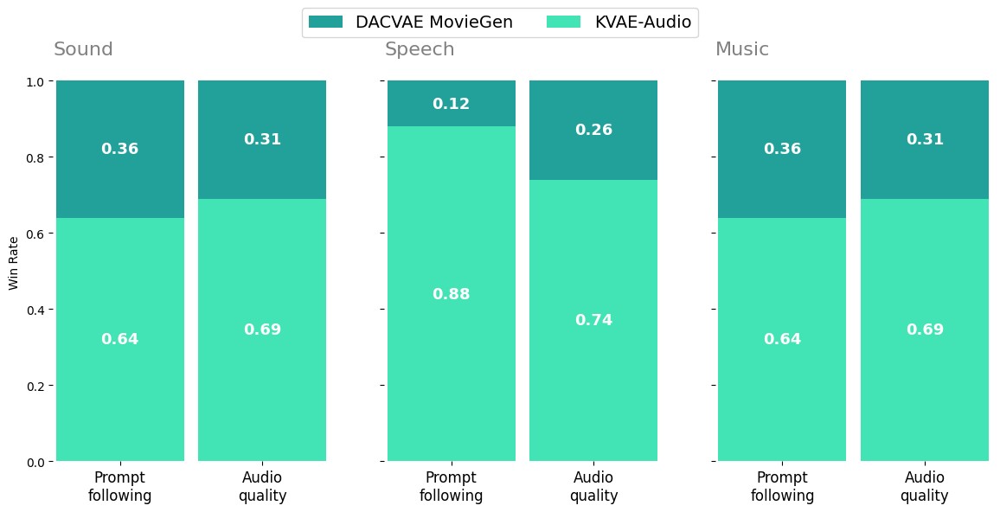
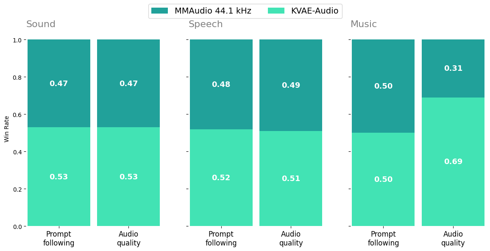
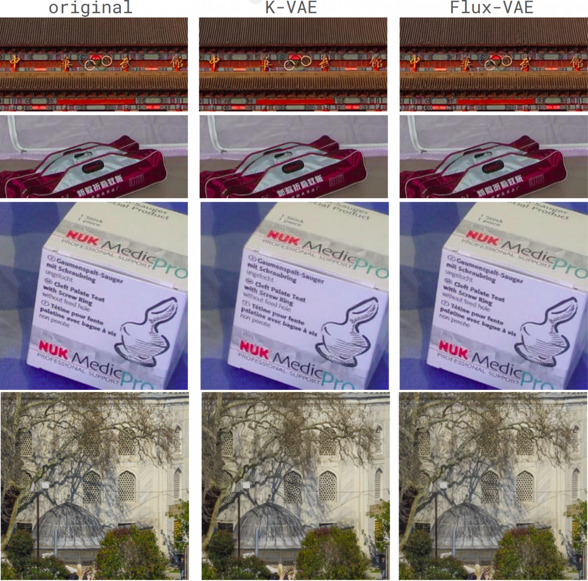
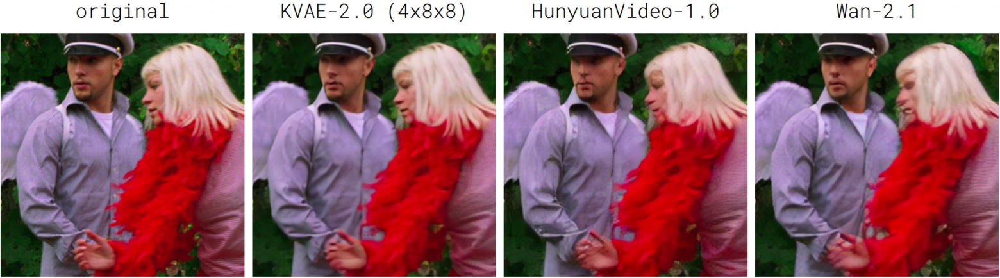
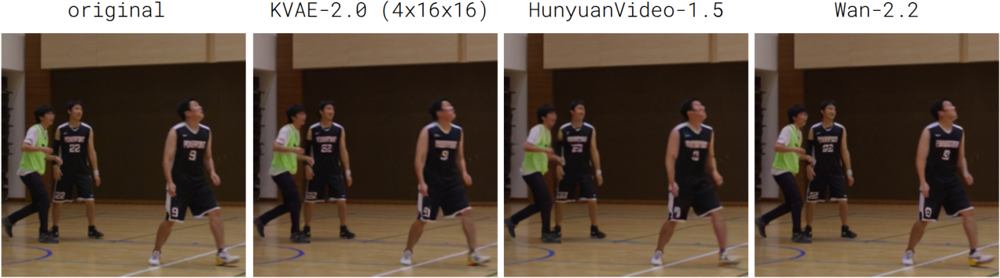
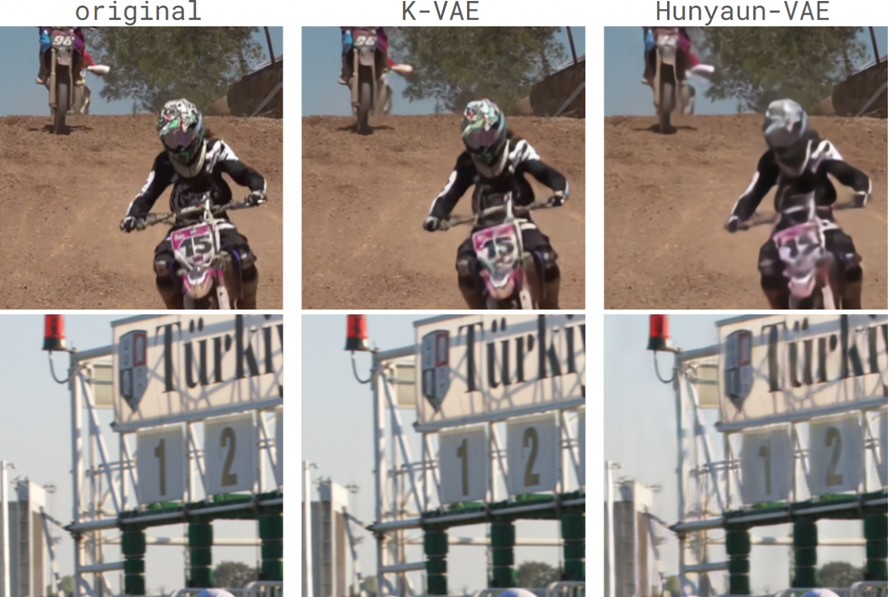

# Evaluation results

Detailed evaluation results for KVAE audio, image, and video tokenizers. The
project overview and quick start are available in [README.md](../../README.md).

**Sections:** [Audio](#kvae-audio) · [Image](#kvae-2d-10) · [Video](#kvae-video-20)

## KVAE-Audio

KVAE-Audio is a continuous full-band 48 kHz audio tokenizer evaluated both as a reconstruction model and as the latent space of a fixed text-to-audio generator.

Generative quality is established under a **fixed generator** — same DiT architecture, training data, and number of steps — varying only the autoencoder. We report objective generation metrics and blind human side-by-side below.

### Evaluation of latent space qualities for generation

### Audio Generation Examples

Below are qualitative examples generated from the same text prompts using four different models.

#### Example 1 (speech)

**Prompt:**  
> Low and gravelly, with a southern Russian accent, a man says slowly, &lt;S&gt;Я говорил тебе, что так и будет&lt;E&gt;. A sharp inhale precedes the line. The space is acoustically dry, with minimal room tone and a slight hiss.

<table>
<tr>
<td align="center"><b>KVAE-Audio</b>

  

https://github.com/user-attachments/assets/0773c3f6-6fd3-45b5-b1a6-29963b2f3e16

<a href="../audio_examples/prompt_01/kvae.wav">Download</a></td>
<td align="center"><b>MMAudio</b>

  

https://github.com/user-attachments/assets/5c2a5bcc-6806-4236-bd59-f390947190d8

<a href="../audio_examples/prompt_01/mma.wav">Download</a></td>
<td align="center"><b>DACVAE MovieGen</b>

https://github.com/user-attachments/assets/bc927d2e-6e76-4a11-a608-8620a5a3ce15

<a href="../audio_examples/prompt_01/moviegen.wav">Download</a></td>
<td align="center"><b>SAME-L</b>

  

https://github.com/user-attachments/assets/8d4d747d-8d47-4c29-a80d-7403e6c5f9e6

<a href="../audio_examples/prompt_01/samel.wav">Download</a></td>
</tr>
</table>

---

#### Example 2 (background)

**Prompt:**  
> In a home kitchen, oil sizzles in a pan, a knife chops on a board, and a woman hums softly in Russian, a refrigerator humming beneath it all. Small kitchen, light reverberation. High-fidelity.

<table>
<tr>
<td align="center"><b>KVAE-Audio</b>

https://github.com/user-attachments/assets/531268ec-e1c9-444b-a742-dd4f4f09fa87

<a href="../audio_examples/prompt_02/kvae.wav">Download</a></td>
<td align="center"><b>MMAudio</b>

https://github.com/user-attachments/assets/5fc4c691-6132-40ec-964d-b70effc439e1

<a href="../audio_examples/prompt_02/mma.wav">Download</a></td>
<td align="center"><b>DACVAE MovieGen</b>

https://github.com/user-attachments/assets/10f17bb1-a61e-446b-b903-0436b4062e0c

<a href="../audio_examples/prompt_02/moviegen.wav">Download</a></td>
<td align="center"><b>SAME-L</b>

https://github.com/user-attachments/assets/312ef06e-872c-46cd-bf33-72c34d5d5775

<a href="../audio_examples/prompt_02/samel.wav">Download</a></td>
</tr>
</table>

---

#### Example 3 (music)

**Prompt:**  
> In a large reverberant hall, a brass band launches into a lively march. Trumpets and cornets carry the melody while trombones drive the harmony, brisk and precise. Clean recording, natural reverb, faint equipment hiss.

<table>
<tr>
<td align="center"><b>KVAE-Audio</b>

https://github.com/user-attachments/assets/3742a5f9-f050-4a56-835d-dafd5b7265ea

<a href="../audio_examples/prompt_03/kvae.wav">Download</a></td>
<td align="center"><b>MMAudio</b>

https://github.com/user-attachments/assets/545539f9-b981-41dc-8299-1f49bce07b0c

<a href="../audio_examples/prompt_03/mma.wav">Download</a></td>
<td align="center"><b>DACVAE MovieGen</b>

https://github.com/user-attachments/assets/147041ed-8599-4976-b818-026b4dd74f0b

<a href="../audio_examples/prompt_03/moviegen.wav">Download</a></td>
<td align="center"><b>SAME-L</b>

  

https://github.com/user-attachments/assets/3dfc1d56-a9e8-4d1e-81b5-b76844a268da

<a href="../audio_examples/prompt_03/samel.wav">Download</a></td>
</tr>
</table>

---

### AudioCaps test set

| Model           | # Params | Latent dim | CLAP↑     | CE↑       | PQ↑       | FAD (PANNs)↓ | FAD (PASST)↓ | FAD (VGGIsh)↓ |
| --------------- | -------- | ---------- | --------- | --------- | --------- | ------------ | ------------ | ------------- |
| MMAudio 44.1kHz | 427.6M   | 40         | *0,336*   | *3,909*   | *6,192*     | *17,873*       | *195,910*      | 1,364         |
| DACVAE MovieGen | 107.7M   | 128        | 0,313     | 3,772     | 6,167     | 20,558       | 234,312      | 1,700         |
| SAME-L          | 852.1M   | 256        | 0,322     | 3,588     | 5,756     | 18,446       | 240,635      | *1,325*       |
| KVAE-Audio      | 166.9M   | 64         | **0,344** | **3,982** | **6,242** | **15,381**   | **193,760**  | **1,210**     |

#### Song Describer

| Model           | # Params | Latent dim | CLAP↑     | CE↑       | PQ↑       | FAD (PANNs)↓ | FAD (PASST)↓ | FAD (VGGIsh)↓ |
| --------------- | -------- | ---------- | --------- | --------- | --------- | ------------ | ------------ | ------------- |
| MMAudio 44.1kHz | 427.6M   | 40         | **0,356** | *7,136*   | *7,707*   | **5,412**    | **158,599**  | **0,356**     |
| DACVAE MovieGen | 107.7M   | 128        | 0,312     | 6,953     | 7,538     | 10,194       | 214,009      | 1,046         |
| SAME-L          | 852.1M   | 256        | *0,345*   | 7,076     | 7,465     | 8,442        | 250,668      | 0,987         |
| KVAE-Audio      | 166.9M   | 64         | 0,339     | **7,216** | **7,929** | *7,971*        | *189,427*      | *0,599*         |

#### LibriSpeech test-clean

| Model           | # Params | Latent dim | CLAP↑     | CE↑       | PQ↑       | FAD (PANNs)↓ | FAD (PASST)↓ | FAD (VGGIsh)↓ | WER↓      | CER↓      |
| --------------- | -------- | ---------- | --------- | --------- | --------- | ------------ | ------------ | ------------- | --------- | --------- |
| MMAudio 44.1kHz | 427.6M   | 40         | 0,368     | *5,704*   | 6,629     | 8,305        | **105,931**  | *2,001*       | *0,257*   | *0,593*   |
| DACVAE MovieGen | 107.7M   | 128        | **0,413** | 5,482     | **7,052** | *5,008*      | 210,478      | **1,501**     | 0,911     | 1,048     |
| SAME-L          | 852.1M   | 256        | 0,379     | 4,617     | 5,024     | 10,257       | 301,508      | 2,721         | 0,349     | 0,629     |
| KVAE-Audio      | 166.9M   | 64         | *0,389*   | **5,906** | *6,940*   | **4,677**    | *185,609*    | 2,138         | **0,244** | **0,576** |

### Reconstructions

Reconstruction is evaluated on open datasets across domains (the released weights directly substantiate these numbers). Baselines: **[MMAudio 44.1 kHz](https://arxiv.org/abs/2412.15322)** VAE, **[DACVAE from MovieGen Audio](https://arxiv.org/abs/2410.13720)**, **[SAME-L](https://arxiv.org/abs/2605.18613)** (Stable Audio 3 VAE).

#### AudioSet eval

| Model           | # Params | Latent dim | MEL↓      | STFT↓     | Waveform↓ | SI-SDR↑   | SDR↑       | SNR↑       |
| --------------- | -------- | ---------- | --------- | --------- | --------- | --------- | ---------- | ---------- |
| MMAudio 44.1kHz | 427.6M   | 40         | *0,636*   | *1,938*   | 0,106     | -32,080   | -2,682     | -2,686     |
| DACVAE MovieGen | 107.7M   | 128        | 0,669     | 2,275     | 0,029     | 8,384     | 9,421      | 9,416      |
| SAME-L          | 852.1M   | 256        | 0,986     | 2,726     | *0,027*   | **9,586** | **10,347** | **10,339** |
| KVAE-Audio      | 166.9M   | 64         | **0,537** | **1,770** | **0,027** | *9,065*   | *9,920*    | *9,933*    |

#### MUSDB18-HQ

| Model           | # Params | Latent dim | MEL↓      | STFT↓     | Waveform↓ | SI-SDR↑    | SDR↑       | SNR↑       |
| --------------- | -------- | ---------- | --------- | --------- | --------- | ---------- | ---------- | ---------- |
| MMAudio 44.1kHz | 427.6M   | 40         | 0,681     | 1,865     | 0,114     | -40,204    | -3,274     | -3,273     |
| DACVAE MovieGen | 107.7M   | 128        | *0,519*   | *1,762*   | 0,024     | 9,688      | 10,046     | 10,047     |
| SAME-L          | 852.1M   | 256        | 0,668     | 1,786     | *0,023*   | *10,278*   | *10,648*   | *10,648*   |
| KVAE-Audio      | 166.9M   | 64         | **0,516** | **1,725** | **0,022** | **10,390** | **10,675** | **10,677** |

#### EARS

| Model           | # Params | Latent dim | MEL↓      | STFT↓     | Waveform↓ | SI-SDR↑    | SDR↑       | SNR↑       | PESQ↑     |
| --------------- | -------- | ---------- | --------- | --------- | --------- | ---------- | ---------- | ---------- | --------- |
| MMAudio 44.1kHz | 427.6M   | 40         | 0,616     | 1,395     | 0,030     | -29,947    | -2,728     | -2,697     | 2,424     |
| DACVAE MovieGen | 107.7M   | 128        | **0,453** | **1,310** | *0,006*   | **10,264** | **10,680** | **10,681** | *4,246*   |
| SAME-L          | 852.1M   | 256        | 0,774     | 1,575     | 0,007     | 9,939      | 10,374     | 10,376     | 2,982     |
| KVAE-Audio      | 166.9M   | 64         | *0,463*   | *1,314*   | **0,006** | *9,952*    | *10,377*   | *10,384*   | **4,266** |

## KVAE-Image 1.0

KVAE-Image 1.0 uses 8 x 8 spatial compression with 16 latent channels. It is evaluated on the validation splits of [ImageNet-256](https://huggingface.co/datasets/benjamin-paine/imagenet-1k-256x256) and [DIV2K](https://data.vision.ee.ethz.ch/cvl/DIV2K/) against Wan-2.1 and Flux. All compared models use the same spatial compression and number of latent channels.

PSNR and SSIM are higher-is-better; LPIPS and rFID are lower-is-better. Bold indicates the best result for each dataset and metric.

### Quantitative reconstruction

| Dataset | Model | PSNR↑ | SSIM↑ | LPIPS↓ | rFID↓ |
| --- | --- | ---: | ---: | ---: | ---: |
| ImageNet-256 (val) | Wan-2.1 | 29.03 | 0.85 | 0.069 | 0.62 |
| ImageNet-256 (val) | Flux | 31.11 | **0.91** | **0.041** | **0.11** |
| ImageNet-256 (val) | **KVAE-2D-1.0** | **31.71** | **0.91** | 0.054 | 0.46 |
| DIV2K | Wan-2.1 | 31.87 | 0.89 | 0.069 | — |
| DIV2K | Flux | 32.64 | 0.91 | 0.061 | — |
| DIV2K | **KVAE-2D-1.0** | **33.67** | **0.92** | **0.060** | — |

**Result.** KVAE-Image 1.0 has the highest PSNR on both datasets. It ties Flux on ImageNet-256 SSIM, while Flux has the best ImageNet-256 LPIPS and rFID. On DIV2K, KVAE-2D-1.0 has the best reported PSNR, SSIM, and LPIPS.

### Qualitative reconstruction

Columns from left to right: original, KVAE-Image 1.0, and Flux-VAE.

## KVAE-Video 2.0

KVAE-Video 2.0 is released in two variants: `t4s8` with 4 x 8 x 8 compression and `t4s16` with 4 x 16 x 16 compression. Reconstruction is evaluated on [MCL-JCV (720p)](https://mcl.usc.edu/mcl-jcv-dataset/).

PSNR and SSIM are higher-is-better; LPIPS is lower-is-better. Bold indicates the best result for each metric.

### KVAE-Video 2.0 (t4s8)

All compared models use 4 x 8 x 8 compression with 16 latent channels.

#### Quantitative reconstruction

| Model | Compression | Latent channels | PSNR↑ | SSIM↑ | LPIPS↓ |
| --- | --- | ---: | ---: | ---: | ---: |
| HunyuanVideo-1.0 | 4 x 8 x 8 | 16 | 34.3 | 0.90 | 0.047 |
| Wan-2.1 | 4 x 8 x 8 | 16 | 34.3 | 0.89 | **0.044** |
| **KVAE-3D-2.0-t4s8** | 4 x 8 x 8 | 16 | **36.0** | **0.92** | 0.047 |

**Result.** KVAE-3D-2.0-t4s8 has the highest PSNR and SSIM. Wan-2.1 has the lowest LPIPS.

#### Qualitative reconstruction

Columns from left to right: original, KVAE-3D-2.0-t4s8, HunyuanVideo-1.0 and Wan-2.1.

### KVAE-Video 2.0 (t4s16)

All compared models use 4 x 16 x 16 compression. HunyuanVideo-1.5 uses tiling with its default parameters because of the full attention block.

#### Quantitative reconstruction

| Model | Compression | PSNR↑ | SSIM↑ | LPIPS↓ |
| --- | --- | ---: | ---: | ---: |
| HunyuanVideo-1.5 | 4 x 16 x 16 | 34.4 | 0.89 | 0.073 |
| Wan-2.2 | 4 x 16 x 16 | 34.2 | 0.89 | **0.037** |
| **KVAE-3D-2.0-t4s16** | 4 x 16 x 16 | **35.4** | **0.91** | 0.048 |

**Result.** KVAE-3D-2.0-t4s16 has the highest PSNR and SSIM. Wan-2.2 has the lowest LPIPS.

#### Qualitative reconstruction

Columns from left to right: original, KVAE-3D-2.0-t4s16, HunyuanVideo-1.5,
and Wan-2.2.

### Latent-space quality for generation

A tokenizer also defines the latent space used by a generative model. The tokenizers were compared through side-by-side human evaluation of generations produced for the same prompts. Participants evaluated prompt adherence, visual quality, and semantic quality. The training data, architecture, and training strategy of the generative model were fixed across the comparison.

KVAE-Video 2.0 has the higher reported win rate in all three categories: 56% for prompt adherence, 54% for visual quality, and 55% for semantic quality.

<strong>Previous version: KVAE-3D-1.0</strong>

KVAE-3D-1.0 was evaluated on [MCL-JCV](https://mcl.usc.edu/mcl-jcv-dataset/) downsampled to 540p because of its limitations at high resolutions. All compared models use 4 x 8 x 8 compression with 16 latent channels. The newer KVAE-Video 2.0 models are evaluated at 720p.

#### Quantitative reconstruction

| Model | PSNR↑ | SSIM↑ | LPIPS↓ |
| --- | ---: | ---: | ---: |
| Wan-2.1 | 33.75 | 0.90 | 0.089 |
| HunyuanVideo-1.0 | 33.91 | 0.91 | 0.103 |
| **KVAE-3D-1.0** | **35.63** | **0.92** | **0.088** |

**Result.** KVAE-3D-1.0 has the best reported PSNR, SSIM, and LPIPS in this
comparison.

#### Qualitative reconstruction

Columns from left to right: original, KVAE-3D-1.0, and HunyuanVideo-1.0.

